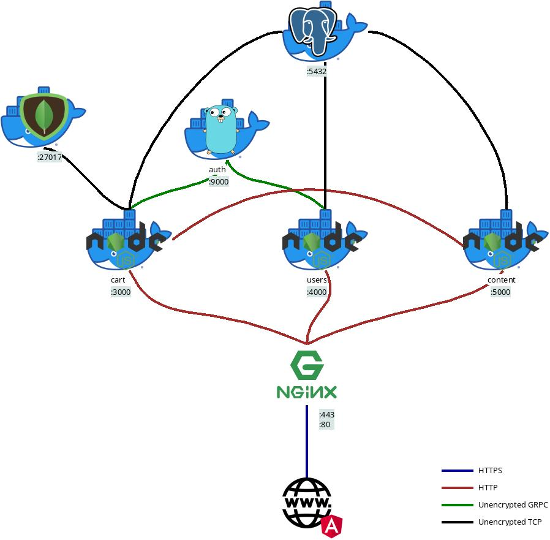

# Web mock (V2)

## Architecture



## Deploy

Execute [deploy.sh](deploy.sh).

Using curl:

```bash
curl -o deploy.sh https://raw.githubusercontent.com/BenjaminGuzman/webmock/v2/deploy.sh && chmod u+x deploy.sh
./deploy.sh
```

Using wget:

```bash
wget -O deploy.sh https://raw.githubusercontent.com/BenjaminGuzman/webmock/v2/deploy.sh && chmod u+x deploy.sh
./deploy.sh
```

## Develop

If you want to run the project locally you'll need to spin up the angular server (described in Frontend section) and 
all the backend microservices (described in Backend section)

### Databases

All the database init files are stored in [mongo](mongo) and [postgres](postgres).

If you want to change a user, password, privileges or whatever, you can do it inside the configuration files provided
in those directories.

Even though v2 is intended to be more professional, security configurations for database are a little bit neglected
just for sake of simplicity (e.g. users are database administrators, user-password is used as authentication method).
But remember **this is a mock app** and you should <u>take security seriously in real-world project</u>.

### Backend

In order to run all backend microservices you need to execute `npm run start` (or `npm run start:dev`) from within each
microservice directory, e.g. to start the _users_ microservice you need to be placed inside 
[`backend/users`](backend/users) and run the already mentioned command.

Note: if you don't want to set up a PostgreSQL database in your machine, you could simply start a docker container with 
`docker compose -f docker-compose-psql.yml up`.

**Note**: If you want to **easily start** everything in development mode, simply use
[Microstart](https://github.com/BenjaminGuzman/microstart). Check [`microstart.yml`](microstart.yml)

**Why there is no gateway?**

For production mode, nginx serves as gateway/reverse proxy.

However, it was not really considered during the architecture design phase just to keep things simple.

In a real-world project you may want to use a gateway and probably use 
[GraphQL Federation](https://www.apollographql.com/docs/federation) or something similar.

A GraphQL gateway would also be very useful for the cart microservice because it could simply store the tracks ids and
to query cart information the gateway queries both microservices, cart (to get the track ids in the shopping cart) and
content (to get the actual data for the tracks).

If you want to learn and practice, you could add a gateway anyway, remember this is **open source** and its sole
purpose is to **learn and practice**.

### Frontend

Simply run `npm run start` from within the [`frontend`](frontend) directory

## Usage

### Special endpoints

There are no special endpoints in v2, yet...

## License

GPLv3
