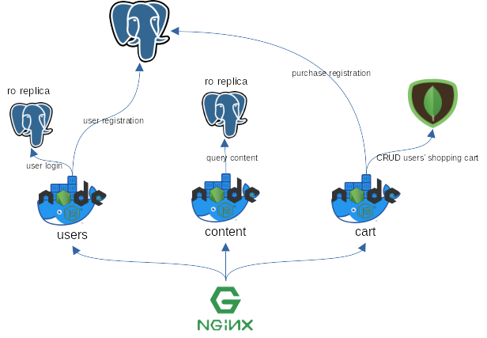

# Web mock (V2)

## Architecture



## Deploy

**Run on local machine**

1. You should create `.env.prod` files for each microservice (inside [`backend`](backend). See `.env.example` files included for each microservice).

2. Copy important files to server

```bash
# copy init files to server
scp -r db/ user@testing.example.com:~/v2/db/
scp docker-compose.yml user@testing.example.com:~/v2
scp backend/users/.env.prod user@testing.example.com:~/v2/backend/users/.env.prod 
scp backend/content/.env.prod user@testing.example.com:~/v2/backend/content/.env.prod 
```

3. Build and copy frontend

```bash
cd frontend && npm run build && scp -r dist/ user@testing.example.com:/var/www/html && cd ..
```

**Run on server**

1. Make NGINX serve the static content

Your configuration should look like this:

```
server {
    // ... your server config ...

    error_page 404 /; # let angular handle 404
    root /var/www/html/dist/webmock;
}
```

Notify selinux.

```chcon -R -t httpd_sys_content_t /var/www/html/dist/webmock```

2. Make NGINX act as gateway (reverse proxy)

```
server {
    // ... your server config ...
    location /v2/users {
        proxy_pass              http://127.0.0.1:4000;
        proxy_set_header        X-Forwarded-For $proxy_add_x_forwarded_for;
    }

    location /v2/content {
        proxy_pass              http://127.0.0.1:5000;
        proxy_set_header        X-Forwarded-For $proxy_add_x_forwarded_for;
    }
}
```

3. Start the application

```bash
sudo docker compose up -d
```

If you need to add HTTPS, you can follow the instructions to do so for version 1

## Develop

If you want to run the project locally you'll need to spin up the angular server (described in Frontend section) and 
all the backend microservices (described in Backend section)

### Databases

All the database init files are stored in [mongo](mongo) and [postgres](postgres).

If you want to change a user, password, privileges or whatever, you can do it inside the configuration files provided
in those directories.

Even though v2 is intended to be more professional, security configurations for database are a little bit neglected
just for sake of simplicity (e.g. users are database administrators, user-password is used as authentication method).
But remember **this is a mock app** and you should <u>take security seriously in real-world project</u>.

### Backend

In order to run all backend microservices you need to execute `npm run start` (or `npm run start:dev`) from within each
microservice directory, e.g. to start the _users_ microservice you need to be placed inside 
[`backend/users`](backend/users) and run the already mentioned command.

Note: if you don't want to set up a PostgreSQL database in your machine, you could simply start a docker container with 
`docker compose -f docker-compose-psql.yml up`.

**Note**: If you want to **easily start** everything in development mode, simply use
[Microstart](https://github.com/BenjaminGuzman/microstart). Check [`microstart.yml`](microstart.yml)

**Why there is no gateway?**

For production mode, nginx serves as gateway/reverse proxy.

However, it was not really considered during the architecture design phase just to keep things simple.

In a real-world project you may want to use a gateway and probably use 
[GraphQL Federation](https://www.apollographql.com/docs/federation) or something similar.

### Frontend

Simply run `npm run start` from within the [`frontend`](frontend) directory

## Usage

### Special endpoints

There are no special endpoints in v2, yet...

## License

GPLv3
