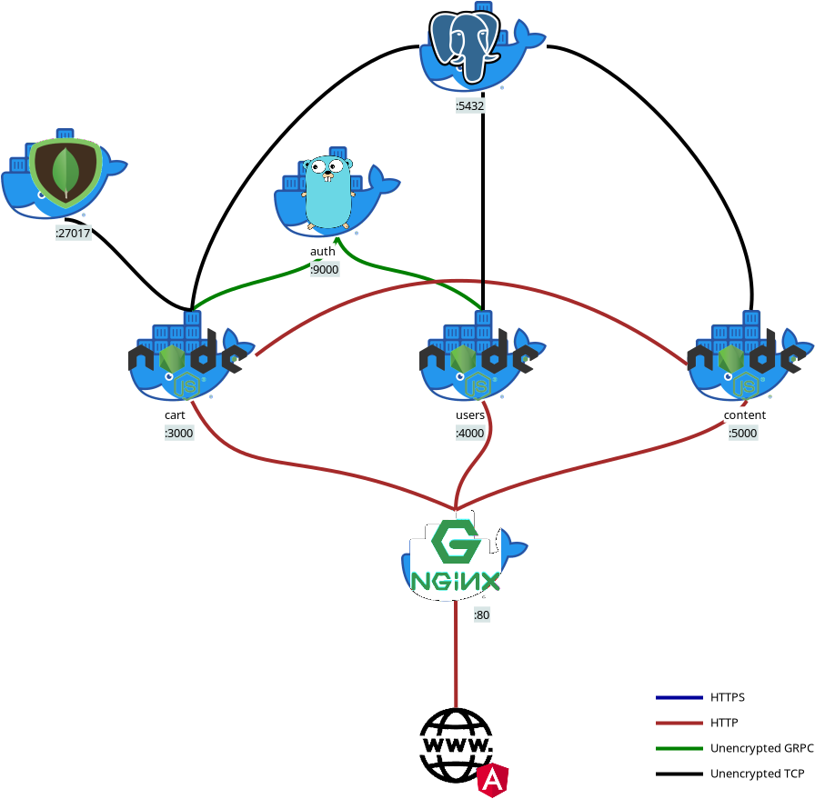

# Web mock

You need to set up version 1 before starting version 2

## Architecture



## Deploy

1. Copy important files

```bash
# copy init files to server (run on local machine)
scp -r db/ user@testing.example.com:~/v2/db/
scp docker-compose.yml user@testing.example.com:~/v2
scp backend/users/.env.prod user@testing.example.com:~/v2/backend/users/.env.prod 
scp backend/content/.env.prod user@testing.example.com:~/v2/backend/content/.env.prod 
```

2. Build and copy frontend

```bash
cd frontend && npm run build && scp -r dist/ user@testing.example.com:/var/www/html && cd ..
```

3. Make NGINX serve the static content

Your configuration should look like this:

```
server {
    // ... your server config ...

    error_page 404 /; # let angular handle 404
    root /var/www/html/dist/webmock;
}
```

Notify selinux.

```chcon -R -t httpd_sys_content_t /var/www/html/dist/webmock```

4. Make NGINX act as gateway (reverse proxy)

```
server {
    // ... your server config ...
    location /v2/users {
        proxy_pass              http://127.0.0.1:4000;
        proxy_set_header        X-Forwarded-For $proxy_add_x_forwarded_for;
    }

    location /v2/content {
        proxy_pass              http://127.0.0.1:5000;
        proxy_set_header        X-Forwarded-For $proxy_add_x_forwarded_for;
    }
}
```

5. Start the application

```bash
# (run on server)
sudo docker compose up -d
```

## Usage

### Special endpoints

There are no special endpoints in v2, yet...

## License

GPLv3
